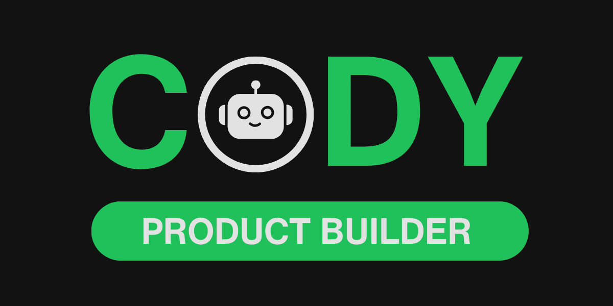

# Cody Product Builder




[](LICENSE.md)
[](https://www.ibuildwith.ai)

# Join our Discord Server
Get the latest updates, news, and more by [joining our Discord community](https://discord.gg/Mz7vdRmpJH).

# Star the Repo
⭐⭐ **If you find this skill helpful, please star this repo to show your support!** ⭐⭐

# About Cody Product Builder
Cody Product Builder is an opinionated, spec‑driven AI agent skill that helps product builders who use vibe coding techniques turn loose ideas into fully planned, production‑ready products using AI. Instead of jumping straight into “vibe coding,” Cody Product Builder guides you through a structured flow - discovery, planning, chunking, and building - so you think clearly before generating code.

Cody Product Builder began as a simple spec‑driven development framework, but it has evolved into a full AI agent skill that includes templates, commands, and a repeatable methodology for building products using AI consistently and fast.

# What Cody Product Builder Helps You Do

### **Idea Discovery & Refinement**  
> Capture sparks of inspiration and shape them into clear, aligned, well‑defined product concepts.

### **Structured Planning (without killing creativity)**  
> Use AI‑ready documents that organize your thoughts, requirements, flows, and decisions - while still letting ideas evolve naturally.

### **Chunked Implementation (Versions)**  
> Break the work into manageable, incremental “versions” that you can build, test, and ship faster with AI.

# Why Cody Product Builder Exists

AI coding tools are powerful - but without structure, things fall apart:

> messy prompts → inconsistent code → unclear requirements → lost context → endless rework.

Cody Product Builder solves this by giving you:

- A repeatable, spec‑driven workflow AI coding tools can follow  
- Templates and commands that eliminate guesswork  
- A shared rhythm between you, your team, and your AI coding agents  
- A clear methodology that turns vibe coding techniques into predictable building  

### What You Get With Cody Product Builder
- A consistent structure for specs, docs, tasks, and versions  
- Faster progress with less rework  
- Better collaboration between humans + AI  
- A methodology for building **products**, not just writing code  

Cody Product Builder blends the creativity of vibe coding techniques with the structure of professional product development - powered by AI from end to end.

# Built for Product Builders Who Use Vibe Coding Techniques

- **Scaffolding:** Templates, docs, and patterns to help you start faster  
- **Agent‑friendly flexibility:** Cody Product Builder guides, you stay in control  
- **AI‑first integration:** Works directly with AI dev environments  
- **Consistency at scale:** Solo or team, Cody Product Builder keeps everything aligned  

# Core Philosophy

Cody Product Builder bridges the gap between brainstorming and systematic development:

- **Structure Without Rigidity** – Supports you without limiting creativity  
- **Iterative Refinement** – Built‑in loops between you and AI  
- **Version‑based Development** – Work broken into modular chunks  
- **Living Documentation** – Docs evolve as your product evolves  

# Two‑Phase Development Cycle

### Phase 1: Plan
Turn raw ideas into actionable plans using three core documents:

### **Discovery Document (`discovery.md`)**  
> Captures the unfiltered initial idea and starts an interactive Q&A with the AI agent. The outcome is a clear vision and baseline requirements.

### **Product Requirements Document (`prd.md`)**  
> Defines “what and why,” including goals, target users, features, success criteria, stories, assumptions, and dependencies.

### **Implementation Plan (`plan.md`)**  
> Defines “how and when,” including architecture, components, data model, milestones, risks, tooling, and delivery strategy.

### Phase 2: Build
The build phase translates the plan into structured, version‑based execution.

### **Feature Backlog (`feature-backlog.md`)**  
> A centralized list of all features, organized into versions with priority and status tracking (🔴 Not Started, 🟡 In Progress, 🟢 Completed).

### **Version Documents**
Each version includes:

#### **Design Document (`design.md`)**  
> Technical implementation guidance, architecture overview, and open questions.

#### **Task List (`tasklist.md`)**  
> A detailed breakdown of tasks derived from the Feature Backlog.

#### **Retrospective (`retrospective.md`)**  
> Lessons learned, improvements, successes, and feedback for both you and the AI agent.

### **Release Notes (`release-notes.md`)**  
> Automatically updated after each version, tracking changes, enhancements, and fixes.

# Version Naming Convention

- **Format:** `v[major.minor.patch]-[name]`  
- **Example:** `v1.0.3-refactor-code`  

### Rules:
- Start at `v0.1.0` unless specified  
- Names ≤ 30 characters, lowercase, alphanumeric + `-`  
- Automatic version increment unless specified  
- `[name]` is optional  

# Command Reference
Commands use the format: `:cody [command]`

| Command | Description |
|--------|-------------|
| `:cody help` | Shows help and all available commands. |
| `:cody plan` | Starts the PLAN phase and creates a new Cody Product Builder project. |
| `:cody build` | Starts the BUILD phase and creates the backlog. |
| `:cody version build` | Builds a specific version and updates release notes once completed. |
| `:cody version add` | Adds a new version to the backlog. |
| `:cody refresh` | Refreshes the AI agent’s memory about the project. |
| `:cody refresh update` | Refresh + sync: updates PRD, plan, and release notes. |
| `:cody relearn` | Forces the AI agent to re-learn how Cody Product Builder works. |
| `:cody assets list` | Lists asset files and their purpose. |

---

# File Structure

```
.claude/
└── commands/              # Claude Code slash commands
    └── cody.md            # Main activation command for Claude Code

.cody/
├── config/                # Configuration and core files
│   ├── activate.md        # Activation instructions for AI agents
│   ├── agent.md           # Core agent instructions and command registry
│   ├── settings.json      # Tool version and settings
│   ├── commands/          # Command implementation files (help, plan, build, etc.)
│   └── templates/         # Document templates for plan and build phases
│       ├── plan/          # Templates for discovery.md, prd.md, plan.md
│       └── build/         # Templates for feature-backlog.md, release-notes.md
│           └── version/   # Templates for design.md, tasklist.md, retrospective.md
└── project/               # Generated project files (created during :cody plan)
    ├── library/           # Project-specific resources
    │   ├── assets/        # Images, diagrams, reference files
    │   ├── docs/          # Tech stack, design system, API documentation
    ├── plan/              # Planning phase documents (discovery, PRD, plan)
    └── build/             # Build phase documents (backlog, release notes, versions)

.github/
└── prompts/               # GitHub Copilot prompt files
    └── cody.prompt.md     # Main activation prompt for GitHub Copilot
```

---

# Best Practices

### Planning Phase
- Be thorough during discovery  
- Break complexity into modular components  
- Identify integrations and dependencies upfront  

### Build Phase
- Start small for early wins  
- Keep the backlog current  
- Use retrospectives deliberately  
- Group features into logical versions  

### AI Collaboration
- Provide context early  
- Treat AI output as drafts  
- Explore alternatives and edge cases  
- Iterate frequently  

# Installing and Using Cody Product Builder

## Installing
1. Clone or download Cody Product Builder from: https://github.com/ibuildwith-ai/cody-product-builder
2. Copy the `.cody`, `.claude`, and `.github` folders into your project root.

## Activating
- **Claude Code**: Use the `/cody` command  
- **GitHub Copilot**: Use the `/cody` command  
- **Other AI Agents**: Say: *"Please read and execute the @.cody/config/activate.md"*  

## Using
- `:cody help` – Overview of all commands  
- `:cody plan` – Begin the structured PLAN phase  

Cody Product Builder works with any AI Development Environment (Claude Code, Codex, Cursor, OpenCode, GitHub Copilot, etc.) with file management capabilities.

## Author

**iBuildWith.ai**

© Copyright 2026 – Red Pill Blue Pill Studios, LLC – All Rights Reserved.

Part of the Cody family of AI Agent Skills:
- Cody Product Builder — Build products with AI
- Cody Article Writer — Write articles with AI

## License

Cody Product Builder is licensed under a custom license that permits free use for product building (including commercial use), but prohibits redistribution, modification, and sale of the software itself.

See [LICENSE.md](LICENSE.md) for complete terms.

## Release Notes

Coming soon.

## Links

- [iBuildWith.ai](https://www.ibuildwith.ai)
- [Agent Skills Specification](https://agentskills.io/specification)