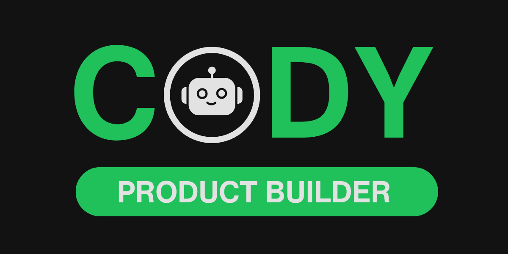

# Cody Product Builder




[](LICENSE.md)
[](https://www.ibuildwith.ai)
[](release-notes.md)

# Star the Repo
⭐⭐ **If you find this skill helpful, please star this repo to show your support!** ⭐⭐

# About Cody Product Builder
Cody Product Builder is a guided workflow (agent skill) that helps knowledge workers and domain experts turn ideas into real products with AI. It structures your thinking from idea to shipped version so you can build without becoming a developer and without the work collapsing into chaos.

Whether you're starting fresh, continuing an existing project, or shipping quick fixes, Cody gives you a repeatable workflow that works with any AI coding environment (Claude Code, Cursor, GitHub Copilot, and others). It surfaces and captures AI-generated ideas so good suggestions aren't lost in chat, and keeps your project buildable as it grows.

**Starting fresh?** Cody walks you through idea refinement, requirements, and planning before a single line of code is written.

**Have an existing project?** Cody analyzes your codebase, understands what's already built, and picks up from there.

**Need a quick fix?** Patches let you skip the full build cycle while still tracking what was changed and why.

**Want to test an idea?** Prototypes let you build a throwaway, interactive mockup to try an idea out before, during, or after planning and building.

# What Cody Product Builder Helps You Do

### **Surface and Evaluate AI-Generated Ideas**
> Capture ideas from both you and AI in one structured place so good suggestions aren't lost in chat. Evaluate them before integrating them into your codebase.

### **Idea Discovery & Refinement**  
> Capture sparks of inspiration and shape them into clear, aligned, well-defined product concepts.

### **Structured Planning (without killing creativity)**  
> Use AI-ready documents that organize your thoughts, requirements, flows, and decisions while still letting ideas evolve naturally.

### **Ship Working Versions**
> Break the work into manageable, incremental "versions" that you can build, test, and ship faster with AI. Each version is complete and shippable.

### **Lightweight Patches**
> Fix bugs and make small enhancements quickly without the overhead of a full version build cycle, while still tracking everything.

### **Prototype an Idea**
> Build a throwaway, interactive mockup to try an idea out, anytime. Prototyping is independent of planning and building. When you plan or build, you can ask Cody to use a prototype to help inform the work.

# Why Cody Product Builder Exists

AI tools are powerful, but without structure, things fall apart: messy prompts, inconsistent code, unclear requirements, lost context, and endless rework. At the same time, good ideas from AI get lost in chat transcripts instead of being captured and evaluated.

Cody Product Builder solves this by giving you:

- A repeatable workflow your AI coding tools can follow that surfaces and captures AI-generated ideas
- Templates and commands that eliminate guesswork and keep momentum going
- A structure that prevents chaos without killing creativity
- A consistent way to break work into shippable versions with clear continuity
- A way to build **real products**, not just generate code

# Two-Phase Development Cycle

### Phase 1: Plan
Turn raw ideas into actionable plans using three core documents:

### **Discovery Document (`discovery.md`)**
> Captures the unfiltered initial idea and starts an interactive Q&A with the AI agent. The outcome is a clear vision and baseline requirements. Used for greenfield projects.

### **Brownfield Analysis (`brownfield-analysis.md`)**
> For existing codebases: captures an autonomous technical audit of the project (tech stack, architecture, dependencies, existing features) combined with targeted user Q&A. Replaces `discovery.md` for brownfield projects.

### **Product Requirements Document (`prd.md`)**
> Defines “what and why,” including goals, target users, features, success criteria, stories, assumptions, and dependencies.

### **Implementation Plan (`plan.md`)**
> Defines “how and when,” including architecture, components, data model, milestones, risks, tooling, and delivery strategy.

### Phase 2: Build
The build phase translates the plan into structured, version-based execution.

### **Feature Backlog (`feature-backlog.md`)**  
> A centralized list of all features, organized into versions with priority and status tracking (🔴 Not Started, 🟡 In Progress, 🟢 Completed).

### **Version Documents**
Each version includes:

#### **Design Document (`design.md`)**  
> Technical implementation guidance, architecture overview, and open questions.

#### **Task List (`tasklist.md`)**  
> A detailed breakdown of tasks derived from the Feature Backlog.

#### **Retrospective (`retrospective.md`)**
> Lessons learned, improvements, successes, and feedback for both you and the AI agent.

### **Patches**
Patches are lightweight fixes or small enhancements that skip the full version build cycle. Each patch lives in its own folder alongside versions in the build directory.

#### **Patch Document (`patch.md`)**
> Captures the problem, the plan, the solution, and files changed. Does not require a design doc, tasklist, or retrospective.

### **Quick Ideas**
Ideas come up all the time while you're building, both from you and from AI. Instead of losing them or context-switching to another app, `:cody idea` lets you capture them on the spot. They're added directly to the Backlog section of the feature backlog and offered as starting points when you create a new version or patch.

### **Release Notes (`release-notes.md`)**
> Automatically updated after each version or patch, tracking changes, enhancements, and fixes.

### **Best Practices (`project-best-practices.md`)**
> Your project's living record of best practices, learned as you build. After every version or patch, Cody captures what it learned (from the retrospective or patch plus the session) into a categorized best-practices file, and reads it back when designing a version, starting a patch, building, and on `:cody refresh`, so every build follows the standards the project has already settled on. Cody keeps it lean: when a new learning contradicts an old rule, it changes or removes the old one rather than piling on. The file lives in a project-level `best-practices/` folder and starts empty, filling in as you build.

# Prototyping

Sometimes you want to test an idea before you commit to it. `:cody prototype` lets you build a throwaway, interactive mockup for exactly that. Prototyping is independent of the Plan and Build phases: you can run it anytime, before planning, while planning, before or during a build, or after one. You build the prototype beginning to end in one session.

### **Prototype Document (`prototype.md`)**
> Captures a single prototype: the idea being tested, what to test, the build approach, an iterative findings log, and your likes and dislikes (what works, what to keep, what to throw away).

Each prototype lives in its own self-contained folder under `prototypes/`. Prototypes are disposable. When you plan or build, Cody mentions any prototypes you have so you can ask it to use one to help inform that work. When a prototype has served its purpose, you choose whether to keep it for reference or delete it.

### Same Session or Separate Session

A prototype is just files in your project (its folder and `prototype.md`), so it does not matter which AI session builds it. What you are really choosing is how much of your conversation the prototype shares with your planning or building work.

**Same session.** Run `:cody prototype` in the session where you are already planning or building. The agent carries that conversation into the prototype, so your discovery answers, the plan you are shaping, and the version you are scoping all inform how the prototype gets built. Use this when the prototype is tightly tied to what you are working on right now and you want that context to shape it.

**Separate session.** Open a new AI dev session and run `:cody prototype` there. The prototyping conversation stays fully isolated from your planning or building session. The prototype is still created in the same project, the files land under `prototypes/` either way. When you go back to your planning or building session and reference the prototype, Cody reads its `prototype.md` to pick up the findings and the likes and dislikes. Use this when you want to keep a long or messy prototype exploration out of your main session so it does not crowd that conversation.

Either way, `prototype.md` is the durable bridge between sessions. In the same session the agent also has the live conversation to draw on; in a separate session `prototype.md` is the one thing that carries over, which is exactly what it is for.

# Version Naming Convention

- **Format:** `v[major.minor.patch]-[name]`  
- **Example:** `v1.0.3-refactor-code`  

### Rules:
- Start at `v0.1.0` unless specified  
- Names ≤ 30 characters, lowercase, alphanumeric + `-`  
- Automatic version increment unless specified  
- `[name]` is optional  

# Command Reference
Commands use the format: `:cody [command]`

| Command | Description |
|--------|-------------|
| `:cody help` | Shows help and all available commands. |
| `:cody plan` | Starts the PLAN phase and creates a new Cody Product Builder project. |
| `:cody build` | Guided build phase: creates the feature backlog if needed, then lets you create a new version, work on an existing version, or work on a patch. |
| `:cody idea` | Quick-capture an idea to the backlog, or view backlog items. |
| `:cody prototype` | Build a throwaway, interactive prototype to test an idea. Independent of the Plan and Build phases; you can ask Cody to use a prototype to help inform planning or a build. |
| `:cody refresh` | Refreshes the AI agent’s memory about the project. Auto-detects brownfield projects. Optionally updates PRD, plan, and release notes. |

---

# File Structure

### The Skill

This is what you install. Cody Product Builder is a single, self-contained Agent Skill folder:

```
cody-product-builder/          # The skill folder (copy this into your agent's skills directory)
├── SKILL.md                   # Skill definition: frontmatter plus agent instructions and command registry
├── commands/                  # Command implementation files
├── references/                # Shared reference content (loaded on demand by commands)
├── scripts/                   # Helper scripts (e.g. activation config resolution)
└── assets/                    # Document templates and other static resources
    ├── cody.json              # Template for project settings
    ├── plan/                  # Templates for discovery.md, brownfield-analysis.md, prd.md, plan.md
    ├── build/                 # Templates for feature-backlog.md, release-notes.md, patch.md
    │   └── version/           # Templates for design.md, tasklist.md, retrospective.md
    ├── prototype/             # Template for prototype.md
    └── best-practices/        # Template for project-best-practices.md
```

In this repository, the skill folder lives at `source/cody-product-builder/`, and a packaged `cody-product-builder.skill` file (a zip of that folder) sits at the repository root for apps that install skills from a file.

### What Cody Creates in Your Project

Once you start using Cody, it generates these in your own project:

```
cody.json                      # Project settings (created during :cody plan)
release-notes.md               # Release notes (location configurable via releaseNotesPath in cody.json)

<project-path>/                 # User-configurable output path (default: cody-projects/product-builder/)
├── plan/                       # Planning phase documents
├── build/                      # Build phase documents (backlog, versions, patches)
├── prototypes/                 # Throwaway prototypes, each in its own self-contained folder
└── best-practices/             # project-best-practices.md, the project's learned rules
```

# Installing and Using Cody Product Builder

## Installing

Cody Product Builder is an Agent Skill. There are two ways to install it; use whichever your app supports.

### Option 1: The `.skill` file (Claude.ai and other apps that support `.skill`)

For Claude.ai (desktop or web), and any other app that installs skills from a file, use the packaged skill file.

1. Download `cody-product-builder.skill` from the repository root: https://github.com/ibuildwith-ai/cody-product-builder
2. Add it as a skill in your app by uploading `cody-product-builder.skill`. In Claude.ai, this is done from your skills settings. For other apps, follow that app's process for adding a `.skill` file.

### Option 2: The skill folder (Claude Code, Cursor, GitHub Copilot, Codex, or any other agent that does not support `.skill`)

For coding agents that load skills from a folder, copy the skill folder into the agent's skills directory.

1. Clone or download Cody Product Builder from: https://github.com/ibuildwith-ai/cody-product-builder
2. Copy the `source/cody-product-builder/` folder into your agent's skills directory, keeping the folder name `cody-product-builder`:
   - **Claude Code**: `.claude/skills/cody-product-builder/`
   - **Cursor**: `.cursor/skills/cody-product-builder/`
   - **GitHub Copilot**: `.github/skills/cody-product-builder/`

A skills directory inside a project makes Cody available for that project only. A skills directory in your home folder makes Cody available across all your projects. Check your agent's documentation for the exact supported locations.

## Activating

Once installed, Cody Product Builder activates two ways:

- **Automatically.** Describe what you want in plain language (for example, "I want to build a product", "help me plan a new app", or "I need to add a new version") and your agent invokes the skill.
- **Explicitly.** Run the `/cody-product-builder` command.

After it activates, drive Cody with the `:cody` commands listed above.

## Using

**Get help and see all available commands:**
`:cody help`

**Starting a new project from scratch:**
`:cody plan` to kick off the planning phase, then `:cody build` to start building.

**Building versions:**
`:cody build` to add a new version or work on an existing one. Cody will create the feature backlog automatically if it doesn't exist yet.

**Quick bug fixes, small enhancements, or updates:**
`:cody build` and choose the patch option for a lightweight fix without going through the full version build cycle.

**Capture an idea for later:**
`:cody idea [description]` to save it to the backlog without interrupting your current work. When you start a new version or patch, Cody will offer your backlog items as a starting point.

**Test an idea with a prototype:**
`:cody prototype` to build a throwaway prototype anytime and test an idea. When you plan or build, Cody mentions your prototypes so you can ask it to use one.

**Working on an existing project:**
`:cody refresh` to have Cody analyze your codebase and generate all planning documents automatically, then `:cody build` to start building.

**Returning to a Cody-managed project in a new AI session?**
Activate Cody first, then `:cody refresh` so the agent reads your existing project documents and picks up where you left off.

## Author

**iBuildWith.ai**

Copyright 2026, Red Pill Blue Pill Studios, LLC. All Rights Reserved.

## License

Cody Product Builder is licensed under a custom license that permits free use for product building (including commercial use), but prohibits redistribution, modification, and sale of the software itself.

See [LICENSE.md](LICENSE.md) for complete terms.

## Release Notes

See [Release Notes](release-notes.md) for version history.